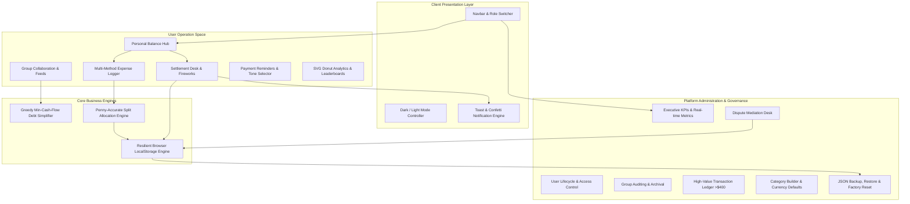

# 💳 ShareWise — Smart Group Expense Sharing & Debt Simplification Platform

[](https://temporary-snappy-bromine-pjya9mf.vercel.app)
[](https://react.dev/)
[](https://vitejs.dev/)
[](LICENSE)
[](https://github.com/2500080283/EXPENSE-SHARING-APP/pulls)

> **Live Production Deployment**: [https://temporary-snappy-bromine-pjya9mf.vercel.app](https://temporary-snappy-bromine-pjya9mf.vercel.app)  
> **Source Repository**: [https://github.com/2500080283/EXPENSE-SHARING-APP](https://github.com/2500080283/EXPENSE-SHARING-APP)

---

## 📌 Executive Summary

**ShareWise** is a production-ready, full-stack financial technology web application designed to eliminate friction and dispute in shared expenditures. Whether dividing apartment rent and utilities among roommates, tracking shared dinners, or managing multi-currency holiday trips, ShareWise simplifies complex group debts into the absolute minimum number of financial transfers using an optimized **Greedy Min-Cash-Flow algorithm**.

Built with a high-performance **React 19 + Vite** architecture and styled with modern, responsive **Vanilla CSS Glassmorphism**, the platform offers distinct operational modules for everyday users and platform administrators.

---

## 🏛️ System Architecture



---

## ✨ Features & Capabilities

### 👤 1. User Module

| Capability | Technical Details |
| :--- | :--- |
| **Personal Balance Hub** | Real-time calculation of overall position (*You are owed*, *You owe*, or *Settled up*) with instant visual indicators and quick-action shortcuts. |
| **Collaborative Spaces (Groups)** | Multi-group support categorized into Apartments, Trips, Dining, Projects, and Couples. Includes activity logs and member stacks. |
| **Advanced Split Engine** | Four mathematical split models: **Equal** (with cent-level reconciliation), **Exact Amounts** (with balance validation), **Percentages** (with sum-to-100% check), and **Weight Shares**. |
| **Smart Debt Simplification** | Toggle dynamically between **Simplified Minimum-Cash-Flow Debts** and **Direct Pairwise Debts** inside each group. |
| **Settlement Desk with Fireworks** | Record payments across 6 payment methods (Venmo, Cash, UPI/GPay, PayPal, Bank Transfer, Revolut) with interactive celebration confetti via `canvas-confetti`. |
| **Payment Reminders System** | Generate automated payment reminder messages with 3 tone presets (*Friendly Nudge*, *Casual Chat*, *Formal Notice*), with 1-click clipboard copy, WhatsApp, and SMS links. |
| **Dispute Filing Mechanism** | Allows members to officially raise dispute tickets on contested transactions directly to the administrative mediation desk. |
| **Interactive Analytics** | Real-time category breakdown with interactive SVG donut charts, top spenders leaderboard, and spending velocity indicators. |
| **1-on-1 Direct Splits** | Split expenses and settle balances directly with friends without requiring a shared group. |
| **CSV Data Export** | 1-Click export of filtered group expenses to standard CSV format for offline spreadsheet analysis. |

---

### 🛡️ 2. Admin Module

| Control Panel | Purpose & Administrative Actions |
| :--- | :--- |
| **Executive Dashboard** | Live platform KPIs: registered users, active collaborative spaces, cumulative transaction volume, and open disputes. |
| **User Account Management** | View user activity, toggle account status (*Active* / *Suspended*), adjust system privileges (*User* / *Admin*), and register new members. |
| **Group Governance** | Audit group spending, view member compositions, inspect currency baselines, and archive or delete stale spaces. |
| **Dispute Mediation Desk** | Centralized console to review flagged member disputes, assess member claims, and submit official resolution notes to close dispute cases. |
| **High-Value Expense Ledger** | Automated security and compliance monitoring highlighting all expenditures exceeding $400 for rapid anomaly detection. |
| **Category Customizer** | Create and manage custom expense categories with custom color palettes and icon bindings. |
| **Data Backup & Disaster Recovery** | Storage quota monitor, instant full-platform JSON database export, JSON schema restore, and factory demo data reset. |

---

## 🧮 Debt Simplification Algorithm

Standard expense sharing creates an exponential web of criss-crossing debts. If Person A owes Person B \$20, and Person B owes Person C \$20, Person A can simply pay Person C \$20 directly, reducing 2 transactions to 1.

ShareWise implements a **Greedy Minimum Cash Flow** algorithm operating in $\mathcal{O}(N \log N)$ time:

### Mathematical Formulation

1. **Calculate Net Balances**: For each participant $i$, compute net balance:
   $$\text{Net}_i = \sum \text{Paid By } i - \sum \text{Owed By } i$$
2. **Partition into Sets**:
   - **Debtors** ($\text{Net}_i < 0$)
   - **Creditors** ($\text{Net}_j > 0$)
3. **Greedy Matching**:
   - Identify the maximum debtor ($\min(\text{Net})$) and the maximum creditor ($\max(\text{Net})$).
   - Transfer amount $T = \min(|\text{Debtor Net}|, \text{Creditor Net})$.
   - Deduct $T$ from both sides until all net balances reach zero.

### Before vs. After Example

```
Before Simplification (4 Criss-crossing Transactions):
  Alice  ── owes $40 ──>  Bob
  Bob    ── owes $30 ──>  Charlie
  Charlie── owes $20 ──>  David
  David  ── owes $10 ──>  Alice

After ShareWise Simplification (2 Direct Transactions):
  Alice  ── pays $30 ──>  Bob
  David  ── pays $10 ──>  Charlie
```

---

## 🎨 UI/UX & Micro-Interactions

ShareWise incorporates modern CSS motion principles for a fluid, responsive feel:
- **Hero Shimmer Sweep**: Subtly moving light reflections across balance banners.
- **Card Interactive Lift**: Smooth cubic-bezier elevation (`translateY(-4px)`) and ambient emerald glow on hover.
- **Pulsing Status Dots**: Live indicators for active accounts and balance states.
- **Notification Bell Ring**: Micro-oscillation animation when unread reminders are pending.
- **Elastic Modal Pop**: Natural scale-and-fade dialog transitions (`cubic-bezier(0.16, 1, 0.3, 1)`).
- **Accessible Motion Support**: Full `@media (prefers-reduced-motion: reduce)` integration respecting user accessibility preferences.

---

## 📂 Project Structure

```
EXPENSE SHARING APP/
├── public/
│   └── vite.svg                      # Application favicon
├── src/
│   ├── components/                   # UI Component Library
│   │   ├── AdminModule/              # Administrator Control Panel
│   │   │   ├── AdminDashboard.jsx    # System KPIs & Overview
│   │   │   ├── CategoryManager.jsx   # Custom Category Builder
│   │   │   ├── DisputeDesk.jsx       # Dispute Mediation Console
│   │   │   ├── GroupOversight.jsx    # Group Governance
│   │   │   ├── SystemSettings.jsx    # JSON Backup & Reset
│   │   │   └── UserManagement.jsx    # User Role & Status Controls
│   │   ├── UserModule/               # User Space Components
│   │   │   ├── AnalyticsView.jsx     # SVG Donut Charts & Insights
│   │   │   ├── ExpenseHistory.jsx    # Complete Expense Feed & Filters
│   │   │   ├── FriendsView.jsx       # 1-on-1 Balances & Direct Splits
│   │   │   ├── GroupDetail.jsx       # Group Feed & Debt Simplification
│   │   │   ├── GroupsView.jsx        # Group Cards Grid & Search
│   │   │   └── UserDashboard.jsx     # Personal Balance Hub
│   │   ├── AddExpenseModal.jsx       # 4-Method Split Expense Dialog
│   │   ├── CategoryIcon.jsx          # Dynamic Lucide Icon Mapper
│   │   ├── CreateGroupModal.jsx      # Group Creation Flow
│   │   ├── DisputeModal.jsx          # Member Dispute Submission Modal
│   │   ├── Modal.jsx                 # Base Accessible Dialog Container
│   │   ├── Navbar.jsx                # Responsive Navigation & Role Pill
│   │   ├── NotificationDrawer.jsx    # Reminders Drawer
│   │   ├── SendReminderModal.jsx     # Tone Selector & Reminder Dispatcher
│   │   ├── SettleUpModal.jsx         # Settle Desk & Confetti Trigger
│   │   ├── Toast.jsx                 # Toast Notification Renderer
│   │   └── UserAvatar.jsx            # User Avatar with Initials Fallback
│   ├── data/
│   │   └── initialData.js            # Initialized Realistic Demo Data
│   ├── utils/
│   │   ├── calculations.js           # Net Balances & Analytics Metrics
│   │   ├── debtSimplifier.js         # Greedy Min-Cash-Flow Algorithm
│   │   ├── formatters.js             # Currency, Date & Relative Time
│   │   └── storage.js                # LocalStorage Persistence Wrapper
│   ├── App.jsx                       # Root Application Controller & Router
│   ├── index.css                     # Design System & Micro-Animations
│   └── main.jsx                      # Application Entry Point
├── index.html                        # HTML5 Document Template
├── package.json                      # Project Manifest & Dependencies
├── vercel.json                       # Vercel Single-Page Application Config
└── vite.config.js                    # Vite 8 Build Configuration
```

---

## 🚀 Quick Start Guide

### Prerequisites
- **Node.js**: Version `18.0.0` or higher
- **npm**: Version `9.0.0` or higher

### 1. Clone the Repository
```bash
git clone https://github.com/2500080283/EXPENSE-SHARING-APP.git
cd "EXPENSE SHARING APP"
```

### 2. Install Dependencies
```bash
npm install
```

### 3. Start Local Development Server
```bash
npm run dev
```
Navigate to [http://127.0.0.1:5173/](http://127.0.0.1:5173/) in your web browser.

### 4. Build for Production
```bash
npm run build
```
The optimized production bundle will be generated in the `dist/` directory.

### 5. Preview Production Build Locally
```bash
npm run preview
```

---

## 🧪 Verification & Code Quality

ShareWise enforces clean code standards through modern automated tooling:

```bash
# Run ESLint validation
npm run lint

# Verify production build compilation
npm run build
```

---

## 🌐 Production Deployment

The project is configured for seamless zero-configuration continuous deployment on **Vercel** with SPA routing support via [`vercel.json`](vercel.json):

```json
{
  "rewrites": [
    {
      "source": "/(.*)",
      "destination": "/index.html"
    }
  ]
}
```

Live deployment: [https://temporary-snappy-bromine-pjya9mf.vercel.app](https://temporary-snappy-bromine-pjya9mf.vercel.app)

---

## 📄 License

This project is licensed under the **MIT License** — see the [LICENSE](LICENSE) file for full details.

---

<p align="center">
  Crafted with precision for frictionless group finances.
</p>
